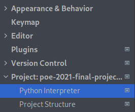
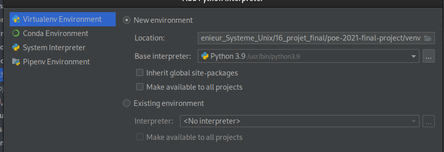

# Configurer le projet sur PyCharm
Nous allons voir comment configurer le projet pycharm afin que nous puissions être assistés par ce puissant IDE.

### Prérequis
* Python installé
* PyCharm Community installé
* Git installé
* La connexion SSH avec GitHub doit être active

1. Dans un terminal, naviguez jusqu'à un dossier dans lequel sera téléchargé le dossier du projet.
2. Lancez la commande `git clone git@github.com:Leikt/poe-2021-final-project.git`
3. Lancez PyCharm, ouvrez un projet, sélectionnez le dossier poe-2021-final-project qui vient d'être créé.
4. Nous allons setup un environnement virtuel pour Python
   1. File > Settings
   2. Aller dans Project:poe... > Python Interpreter\

   3. Petit flèche de droite > Show all\

   4. Cliquez sur le +
   5. Assurez-vous de bien avoir sélectionner Virtualenv Environment et cliquez sur OK\

La confgiuration du projet est terminée. Vous pouvez faire des modifications puis les push sur le github.